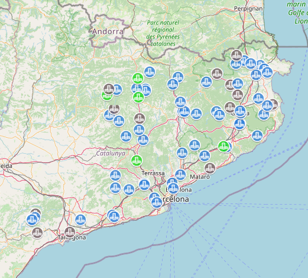

# VectorTiles setup

Test project to serve a layer using VectorTiles.

## Notes:
* Geographic data is located in a Postgres DB with the PostGis extension.
* Geoserver needs to have the VectorTile extension. For version 2.16.4: <https://sourceforge.net/projects/geoserver/files/GeoServer/2.16.4/extensions/>

## Next steps:
* Fix issue with features at the tile edges